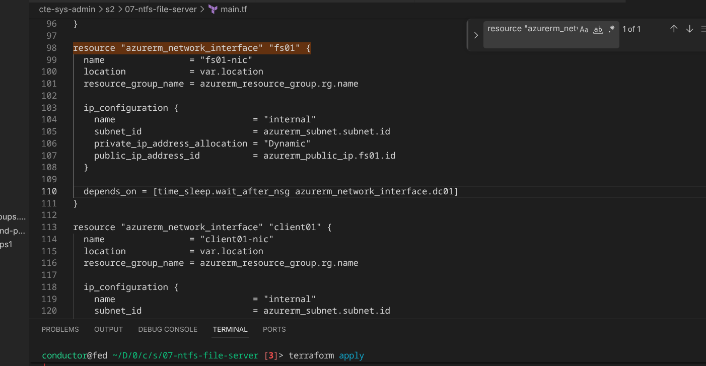
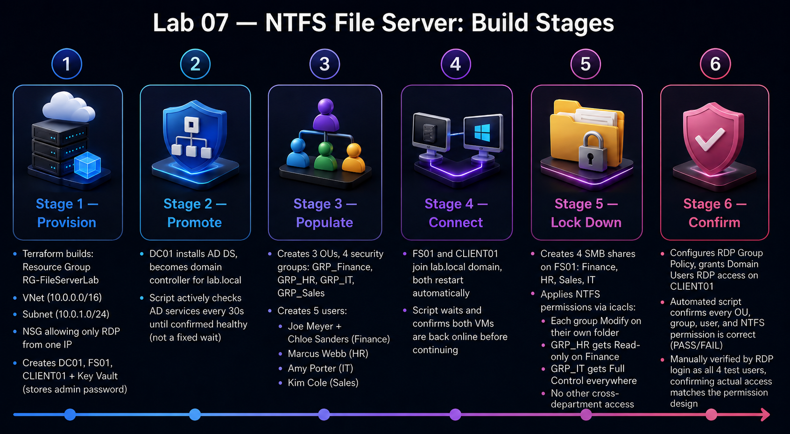
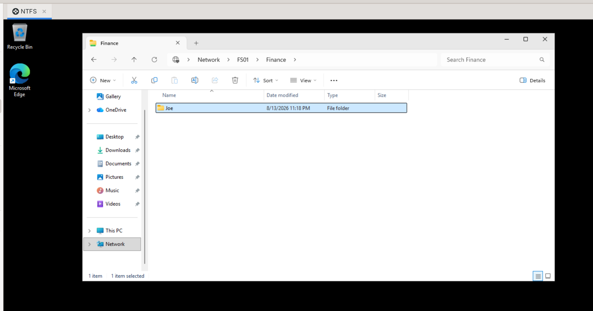
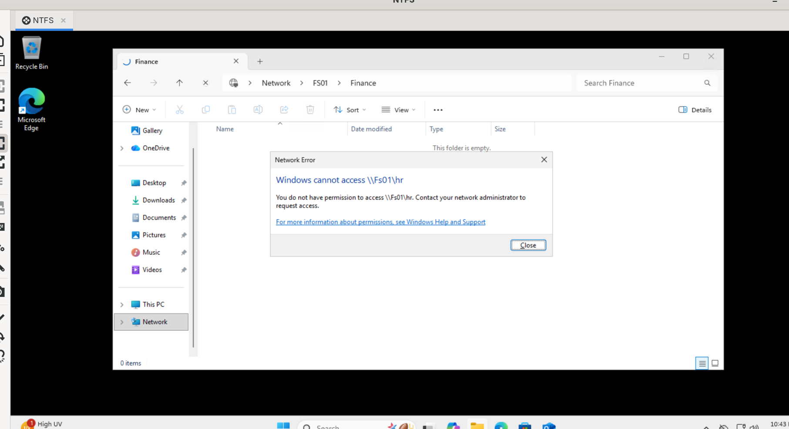
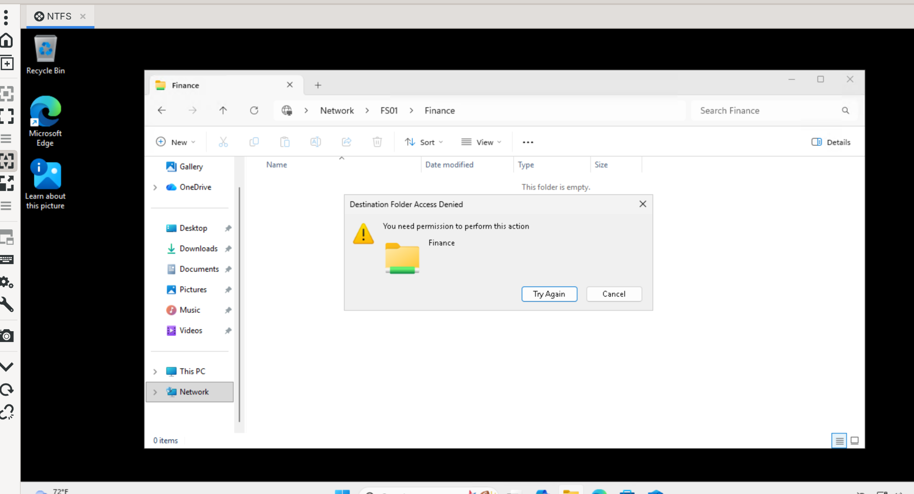
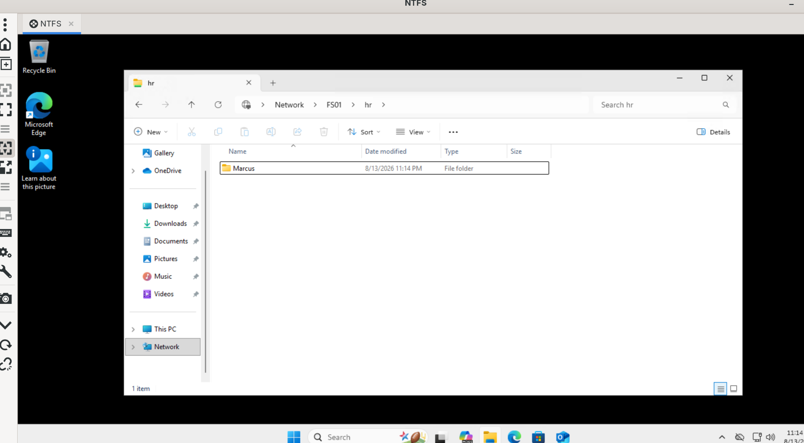
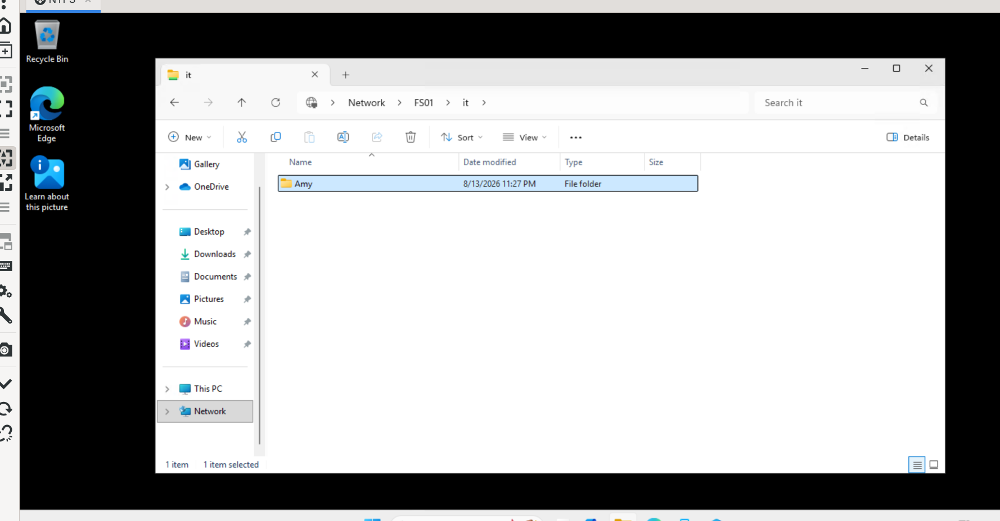
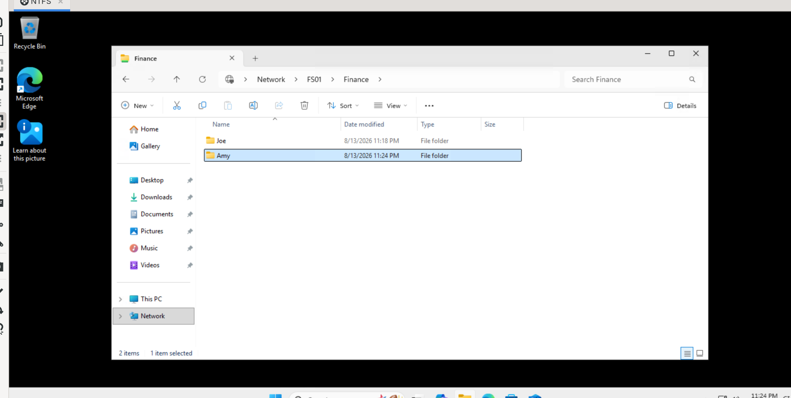
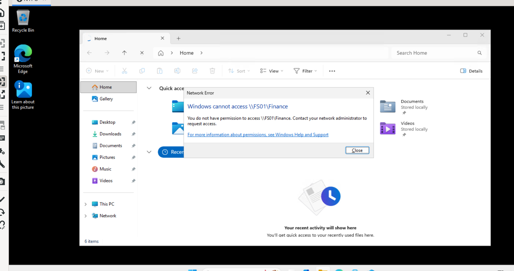
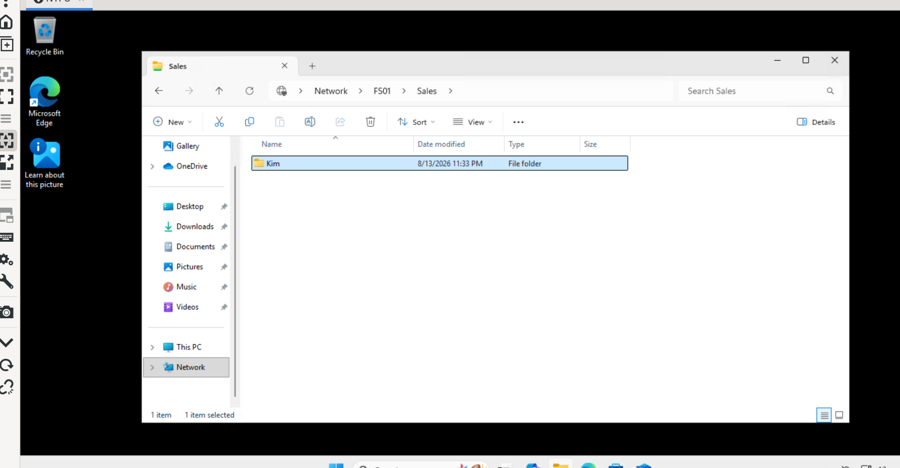

# 07 NTFS File Server Lab

Active Directory · NTFS Permissions · SMB File Services · Group Policy · Terraform · PowerShell · Azure

---

## [▶️ Lab Walkthrough Video](https://www.loom.com)

## What This Lab Covers

This lab builds a Windows domain and centralized file server in Azure, then uses Active Directory security groups and NTFS permissions to control which departments can access company data.

I deployed the infrastructure with Terraform, promoted DC01 into a domain controller for `lab.local`, created OUs, users, and security groups, joined FS01 and CLIENT01 to the domain, configured SMB shares with group-based NTFS permissions, applied an RDP Group Policy, and automated the final validation with PowerShell.

The goal was to model a common Windows systems administration workflow: users receive access through group membership instead of permissions being assigned directly to individual accounts.

## Focus Areas

| Area | What I did |
| --- | --- |
| Active Directory | Built lab.local, created 3 OUs, 4 security groups, and 5 test users |
| File services | Created Finance, HR, Sales, and IT SMB shares on FS01 |
| NTFS permissions | Applied department-based access with icacls |
| Group Policy | Configured RDP policy for the domain-joined workstation |
| Azure | Deployed 3 Windows VMs, networking, NSG, and Key Vault |
| Terraform | Provisioned the Azure infrastructure as code |
| PowerShell | Automated AD promotion, domain joins, file shares, permissions, GPO, and verification |
| Security | Restricted inbound RDP to one source IP and kept the VM admin password in Key Vault |

## Architecture



The environment uses three Windows VMs on the same Azure VNet:

- DC01 — Windows Server 2022 domain controller running Active Directory, DNS, and Group Policy
- FS01 — Windows Server 2022 file server hosting the SMB shares
- CLIENT01 — Windows 11 Pro workstation used to test domain logins and file access

DC01 uses the static private IP `10.0.1.4` because the other domain members use it for DNS. FS01 and CLIENT01 use dynamic private IPs.

## Build Stages



### 1. Provision

Terraform builds the Azure infrastructure:

- RG-FileServerLab
- VNet and subnet
- RDP-restricted NSG
- DC01, FS01, and CLIENT01
- Azure Key Vault
- Public IPs and NICs

The VM administrator password is supplied through an environment variable and stored in Key Vault rather than committed to the repository.

### 2. Promote

DC01 installs Active Directory Domain Services and is promoted into the domain controller for lab.local.

Instead of relying only on a fixed delay after promotion, the orchestration script actively checks Active Directory until Get-ADDomain succeeds before continuing. This prevents later configuration from starting while AD is still initializing.

### 3. Populate

PowerShell creates the directory structure and test identities:

| User | Username | Department | Security Group |
| --- | --- | --- | --- |
| Joe Meyer | joe.meyer | Finance | GRP_Finance |
| Chloe Sanders | chloe.sanders | Finance | GRP_Finance |
| Marcus Webb | marcus.webb | HR | GRP_HR |
| Amy Porter | amy.porter | IT | GRP_IT |
| Kim Cole | kim.cole | Sales | GRP_Sales |

The lab also creates three OUs: Lab Users, Lab Groups, Lab Computers.

### 4. Connect

FS01 and CLIENT01 are configured to use DC01 (10.0.1.4) for DNS and then join lab.local.

Both systems restart automatically after the domain join. The orchestration script waits for each VM to return online before moving to the next configuration step.

### 5. Lock Down

FS01 hosts four SMB shares:

| Share | Access |
| --- | --- |
| \\\\FS01\\Finance | Finance — Modify · HR — Read · IT — Full Control |
| \\\\FS01\\HR | HR — Modify · IT — Full Control |
| \\\\FS01\\Sales | Sales — Modify · IT — Full Control |
| \\\\FS01\\IT | IT — Full Control |

NTFS permissions are applied with icacls. This creates the access model I wanted to test: permissions are assigned to AD security groups, not directly to individual users.

### 6. Confirm

```
Terraform Apply
 ↓
Promote DC01
 ↓
Wait for AD readiness
 ↓
Create OUs / Groups / Users
 ↓
Join FS01 to lab.local
 ↓
Configure SMB + NTFS
 ↓
Join CLIENT01 to lab.local
 ↓
Configure RDP access + GPO
 ↓
Run automated verification
```

The lab includes automated PASS/FAIL checks for the AD objects, group memberships, SMB shares, and expected NTFS permissions. RDP access itself was verified manually — I logged in as each test user from CLIENT01 and confirmed their actual file access matched the intended design.

## Automation

The configuration is driven by configure-lab.ps1, which orchestrates the individual PowerShell scripts through Azure VM Run Command.

Using Azure VM Run Command means the configuration scripts can execute remotely without opening WinRM 5985 through the NSG.

## Verification

I tested the permission model from CLIENT01 using each domain account, confirming the complete chain: Domain User → AD Security Group → NTFS ACL → SMB Share → Allowed or Denied.

Created a folder inside \\FS01\Finance to confirm write access, not just browse access.



Attempting \\FS01\HR as joe.meyer returned Access Denied, as expected — GRP_Finance has no entry on the HR share.



**marcus.webb — Finance read-only, HR full access**

Attempting to create a file in \\FS01\Finance as marcus.webb failed with a permission error, confirming GRP_HR's read-only access to Finance.



Creating a folder in \\FS01\HR as marcus.webb succeeded, confirming full Modify access to his own department's share.



**amy.porter — Full Control across departments**

Created a folder in \\FS01\IT as amy.porter, confirming Modify access to her own department.



Created a folder in \\FS01\Finance as amy.porter, confirming GRP_IT's Full Control extends across every department, not just her own.



**kim.cole — No Finance access**

Attempting \\FS01\Finance as kim.cole returned Access Denied — GRP_Sales has no entry on the Finance share at all.



Created a folder in \\FS01\Sales as kim.cole, confirming full Modify access to her own department's share.



## Security Decisions

A few design choices were intentional:

- RDP 3389 is restricted to one specified source IP instead of 0.0.0.0/0.
- WinRM is not exposed through the NSG.
- VM-to-VM traffic stays inside the Azure VNet.
- DC01 has a static private IP so domain DNS remains consistent.
- The VM administrator password is stored in Azure Key Vault.
- terraform.tfvars, Terraform state files, and other sensitive or local files are excluded from Git.
- Department permissions are group-based so access can be managed through membership instead of individual ACL changes.

## What I Learned

The biggest takeaway from this lab was seeing how the pieces of a Windows domain fit together operationally. Active Directory identifies the users and groups, DNS allows domain members to locate the domain controller, SMB exposes the shared folders, and NTFS provides the actual file-system enforcement.

I also got more practice treating Windows administration as automation instead of a GUI-only workflow. Terraform builds the Azure layer, while PowerShell handles the Windows configuration and verifies that the finished environment matches the intended state.

## Troubleshooting

| Problem | Fix |
| --- | --- |
| Domain join fails because lab.local does not resolve | Confirm the client uses DC01 10.0.1.4 as DNS and that AD is fully ready |
| Cannot RDP to a VM | Check the current public IP and make sure rdp_source matches it |
| Unexpected Access Denied | Run whoami /groups and verify the user belongs to the expected AD group |
| GPO is not applying | Run gpupdate /force and check gpresult /r |
| Key Vault lookup fails | Re-authenticate with az login and verify Key Vault permissions |
| CLIENT01 image deployment fails | Verify the Windows 11 image SKU is available in the selected Azure region |
| Terraform deployment hits quota | Check regional VM-family quota and choose a VM size with available capacity |

## Tools & Technologies

Azure · Terraform · PowerShell · Windows Server 2022 · Windows 11 · Active Directory Domain Services · DNS · Group Policy · SMB · NTFS · icacls · Azure Key Vault · Azure CLI
